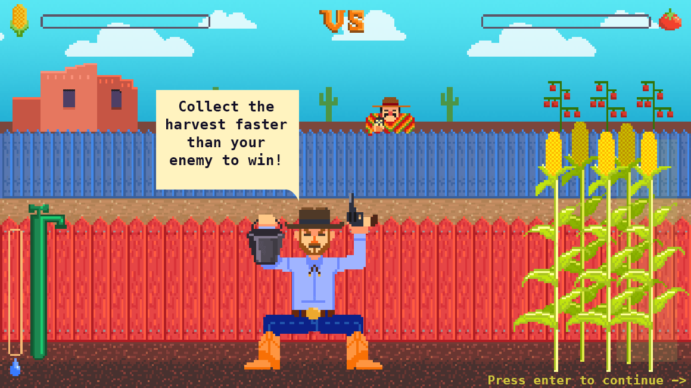

# Wild West Farm Shooter (Remaster!)



[Original game](https://github.com/cat-in-the-dark/old48_34_game) was created back in 2015 at Ludum Dare 32.

This remaster allows you to play the game in a Web Browser!

## What's inside?

This turborepo uses [pnpm](https://pnpm.io) as a package manager. It includes the following packages/apps:

### Apps and Packages

- `apps/server`: websockets server for the multiplayer support.
- `apps/game`: Pixi.js application.
- `packages/cat-lib`: CAT_IN_THE_DARK typescript helper library.
- `packages/cat-lib-web`: CAT_IN_THE_DARK typescript helper library for web (inputs, etc.).
- `packages/shared`: Shared code for client and server: messages schemas, constants.
- `packages/eslint-config-custom`: `eslint` configurations.
- `packages/tsconfig`: `tsconfig.json`s used throughout the monorepo.

Each package and app is 100% [TypeScript](https://www.typescriptlang.org/).

This application uses [pnpm](https://pnpm.js.org/). You can enable it in nodejs with `corepack enable`.

I recommend install nodejs via [fnm](https://github.com/Schniz/fnm) version manager.

### Build

To build all apps and packages, run the following command:

```
pnpm run build
```

Start the server and preview client side

```
pnpm run start
```

### Develop

To develop all apps and packages, run the following command:

```
pnpm run dev
```
